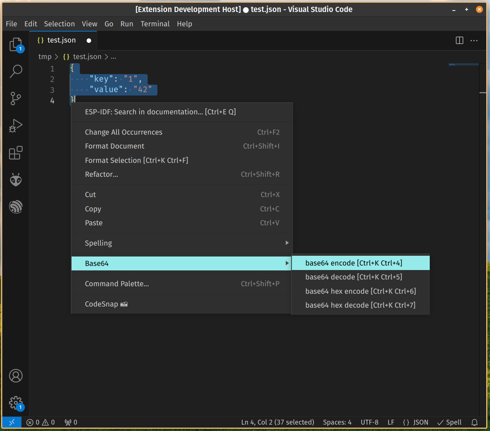

# base64

base64 is a vscode extension to encode/decode Base64 data. It can encode multi-lines strings too (for instance JSON). It also supports Hex to Base64.

## Features

You can select text and encode/decode to/from Base64. Search in command palette for base64 or use the key bindings. Multi-lines and Hex to Base64 is supported.




## Key Bindings

```
encode text to Base64:  Ctrl+Shift+6 (Ctrl+Cmd+6 in Mac)
decode Base64 to text:  Ctrl+Shift+7 (Ctrl+Cmd+7 in Mac)
encode Hex to Base64:   Ctrl+Shift+8 (Ctrl+Cmd+8 in Mac)
decode Base64 to Hex:   Ctrl+Shift+9 (Ctrl+Cmd+9 in Mac)
```

## Release Notes

### 0.1.0

- Add actions in context menu
- Validate if text is selected

### 0.0.4

Bug fix in Unicode encoding

### 0.0.3

Better description

### 0.0.2

- Adding icon to plugin
- Better keybindings for Mac

### 0.0.1

Initial release of base64