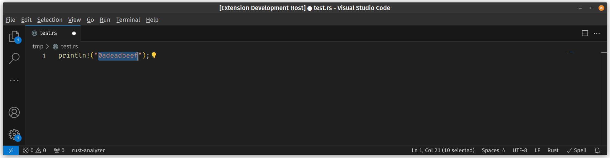

# base64

base64 is a vscode extension to encode/decode base64 data.

## Features

You can select text and encode/decode to/from base64. Search in command pallete for base64 or use the key bindings.




## Key Bindings

```
encode text to base64:  Ctrl+Shift+6 (Cmd+Shift+6 in Mac)
decode base64 to text:  Ctrl+Shift+7 (Cmd+Shift+7 in Mac)
encode hex to base64:   Ctrl+Shift+8 (Cmd+Shift+8 in Mac)
decode base64 to hex:   Ctrl+Shift+9 (Cmd+Shift+9 in Mac)
```

## Release Notes

### 0.0.1

Initial release of base64
